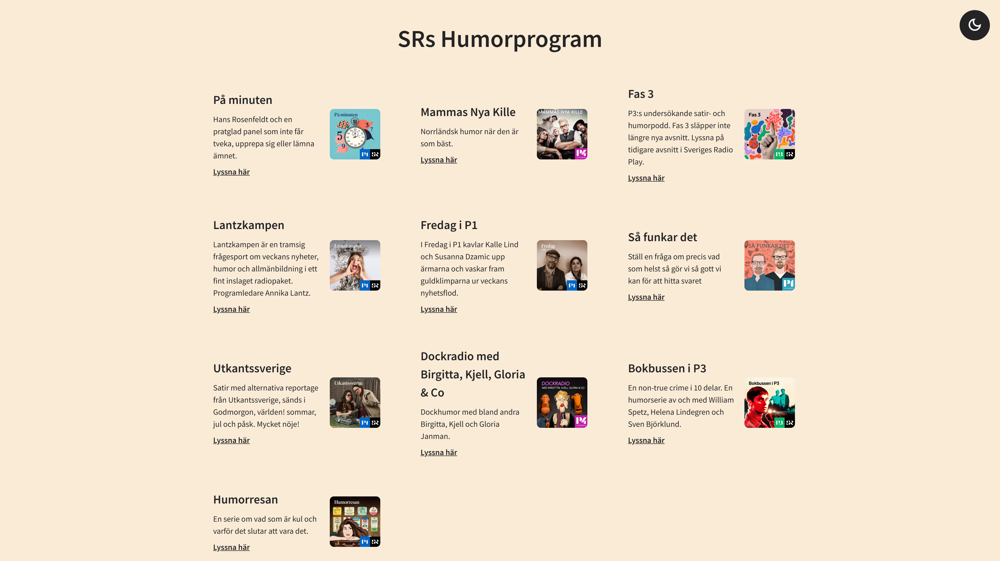
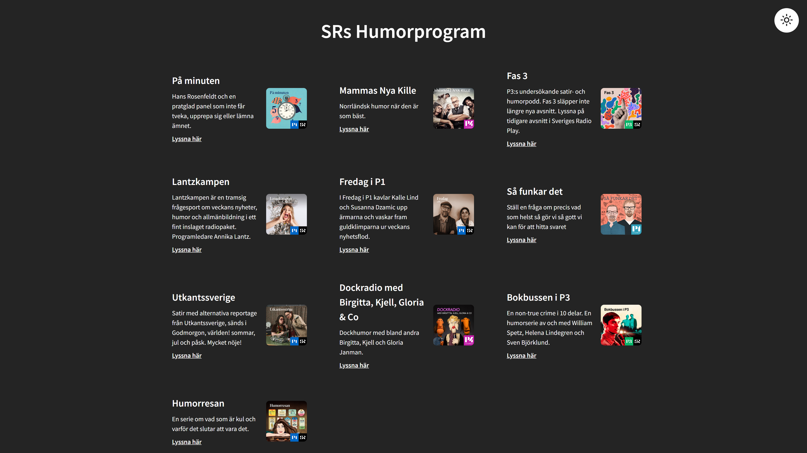
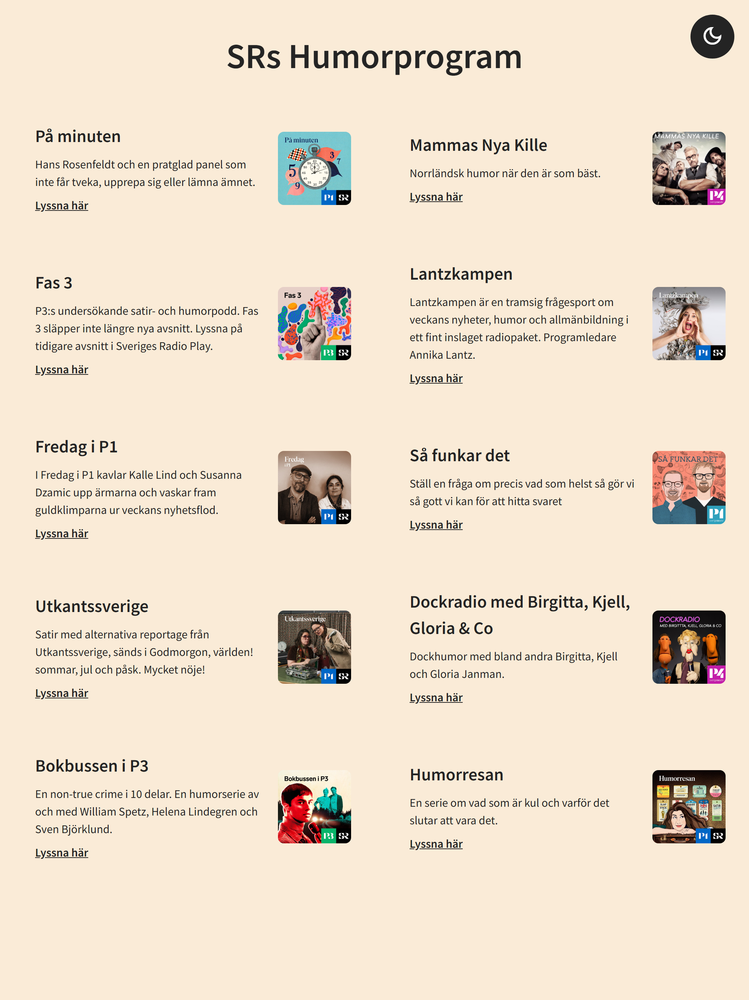
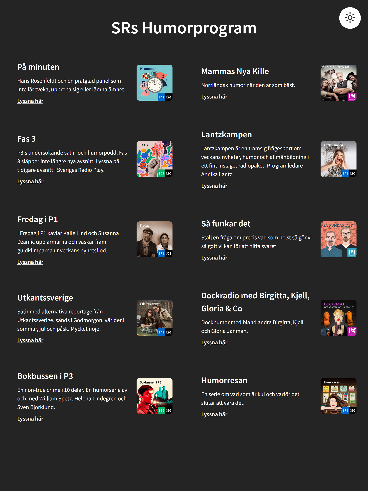
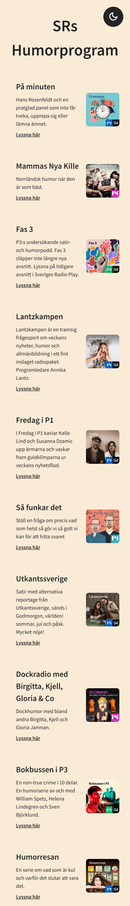
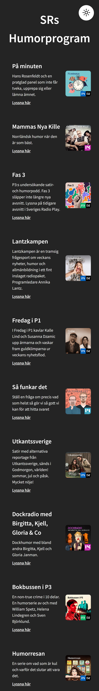
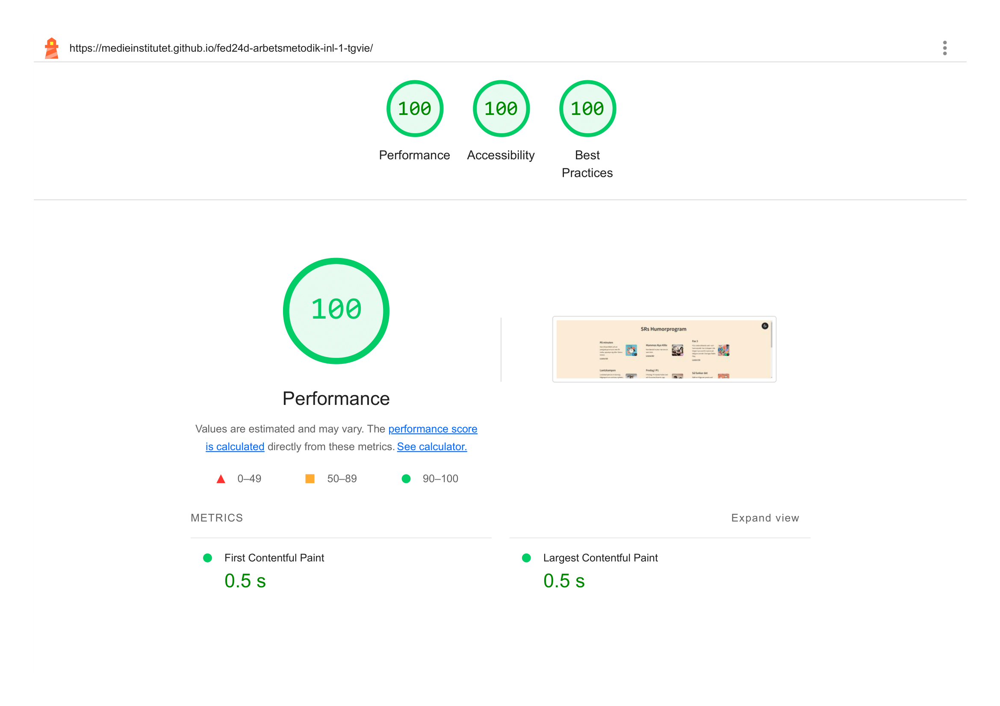
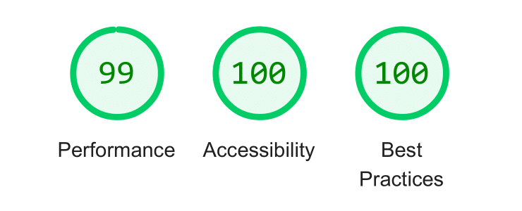

# 🎭 SR Humorprogram 
This project fetches a list of comedy shows from Sveriges Radio using an API and displays them with a name, image, short description, and a link to listen.

It was part of an assignment in my education, where I worked on fixing and improving code left by another developer.

**🔗 Demo: https://tgvie.github.io/MI-code-smells-practice/**

<details>
<summary><strong>🧾 Assigment Requirements</strong></summary>

#### Checklist of things I’ve fixed:
| Pass Level (G) | Higher Level (VG) |
|----------------|-------------------|
| ✅ Got the project working | ✅ Put things in the right place |
| ✅ Converted CSS to Sass | ✅ Handled logging effectively |
| ✅ Consistent naming in CSS | ✅ Performed an accessibility review of the page |
| ✅ Converted to TypeScript | ✅ Used Sass features in the CSS |
| ✅ Mobile view | ✅ Removed unused packages |
| ✅ Language cleanup | ✅ Fixed errors in the API call |
| ✅ Cleaned up logging | ✅ Ran a Lighthouse analysis |
| ✅ Documentation | ✅ Implemented dev-environment |
| ✅ Accessibility | ✅ Consistent CSS syntax |
| ✅ Refactored functions | ✅ Deployed the site on GitHub Pages |
| ✅ Removed unnecessary code |  |
| ✅ Removed code that shouldn’t be included |  |
</details>

## 🖼️ Preview
| Desktop ☀️ | Desktop 🌑 |
| ---------- | ----------- | 
|  |  |

| Tablet ☀️| Tablet 🌑 |
| -------- | ---------- | 
|  |  |

| Phone ☀️ | Phone 🌑 |
| -------- | --------- | 
|  |  |

## 🛠️ Tech Stack


<hr>

## 🔧 Setup Guide
<details>
<summary>1️⃣ Clone Project</summary>
  
```bash
git clone https://github.com/username/repo-name.git
cd repo-name
```
</details>

<details>
<summary>2️⃣ Install Dependencies</summary>
  
```
pnpm install
```
- Then run:
```
pnpm build
pnpm run dev
```
</details>

## 📋 Documentation
<details>
<summary><strong>Lighthouse Report</strong></summary>

| Desktop | Phone |
| ------- | ----- |
|  |  |
</details>

<details>
<summary><strong>Code Validation</strong></summary>

| HTML | CSS |
| ---- | --- |
|  |  |
</details>

## 📋 Dokumentation

<details>
<summary><strong>Lighthouse Report</strong></summary>

| Desktop | Phone |
| ------- | ----- |
|  |  |
</details>

<div align="right">
  
## ✍️ Author/s
🧑‍💻 [@tgvie](https://github.com/tgvie)

</div>
